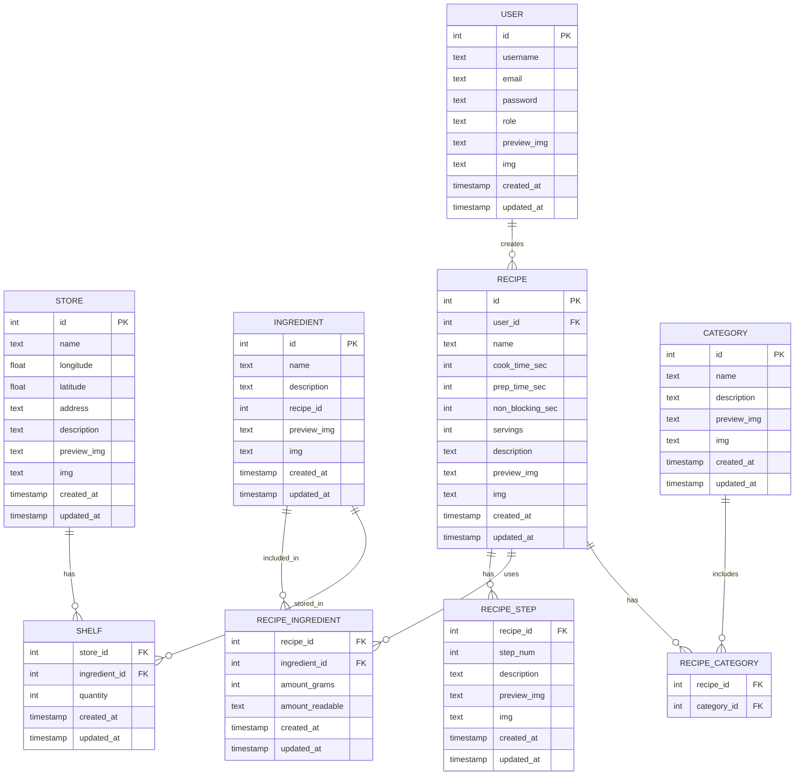

# Database

## Entity Relationship Diagram

Tables that store real life objects should inherit from a superclass `Entity` that has columns `preview_img`, `img`. All tables including `Entity` then inherits from the `default_table` table that has columns `created_at` and `updated_at`.
